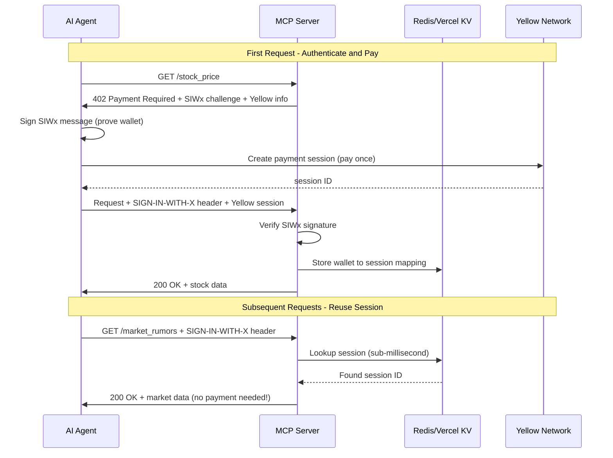

<div align="center">

# eXpress402

  

  <h3>⚡ Extreme DeFi Payments for AI Agents ⚡</h3>

  [](https://hackmoney.ethglobal.com/)
  [](https://yellow.org)
  [](https://x402.org)
  [](https://modelcontextprotocol.io)

  [](https://github.com/vhspace/eXpress402/actions)
  [](https://nodejs.org/)
  [](https://www.typescriptlang.org/)
  [](https://opensource.org/licenses/MIT)
</div>

A paid MCP server for web3 agents to access real-time market data at scale. Set up once with x402 on Yellow Network's off-chain payment channels, then make unlimited queries without per-transaction blockchain fees. Built for high-volume agent workflows requiring bulk financial data.

## Overview

Web3 agents need market data, but traditional per-call blockchain transactions create bottlenecks and excessive fees. eXpress402 solves this by combining x402 v2 with SIWx wallet authentication and Yellow Network's off-chain channels - agents authenticate once with their wallet, pay once for a session, then make unlimited queries without additional payments or authentication. Perfect for AI agents running high-frequency trading strategies, portfolio analysis, or market research.

## Architecture: SIWx + Yellow Network



**Key Innovation: Pay Once, Call Many Times**

- First call: Authenticate with wallet signature + Create Yellow session + Pay
- Subsequent calls: Verify signature + Reuse session + No payment
- Sub-millisecond session lookup (Redis/Vercel KV)
- Standards-compliant (x402 v2 + CAIP-122 SIWx)

## Features

### 🎉 NEW: Full Quorum 2 Support!

The minimal session demo (`npm run minimal-session`) now demonstrates **complete quorum 2 governance** where both agent AND merchant sign all operations:
- ✅ `create_app_session` with quorum 2
- ✅ `close_app_session` with quorum 2
- ✅ Full balance verification at each step
- ✅ Merchant payment confirmed

See `docs/history/QUORUM-2-SOLVED.md` for the technical breakthrough!

### Core Features

- **Prepaid Payment Sessions**: Fund once via x402, query thousands of times without additional transactions
- **Off-Chain Settlement**: Yellow Network channels eliminate per-call blockchain fees
- **Real Market Data**: Live stock prices, market sentiment, and financial news from production APIs
- **Agent-Optimized**: Built for MCP-compatible AI agents requiring high-volume data access

## Quick Start

### For Cursor/Claude Code Users (Devcontainer - Recommended)

1. Open project in Cursor or VS Code
2. Click "Reopen in Container" when prompted
3. Wait for container to build (first time: ~2 minutes)
4. Done! Redis auto-starts, dependencies installed, everything ready

### For Local Development

```bash
npm run setup     # One command - everything automated!
                  # - Generates agent wallet
                  # - Generates merchant wallet
                  # - Auto-funds from Yellow faucet
                  # - Installs dependencies

npm run demo:siwx # Test SIWx integration
```

**Fully automated** - No manual steps required for sandbox testing!

### Manual Setup

```bash
npm install
npm run generate-wallet  # Creates AI agent wallet
npm run dev              # Start MCP server
```

## How It Works

**SIWx (Sign-In-With-X)** provides CAIP-122 compliant wallet authentication, proving AI agent identity without requiring accounts or passwords. Combined with **Yellow Network** off-chain settlement, this enables:

1. **First Request**: Agent signs challenge with wallet -> Creates Yellow session -> Pays once
2. **Subsequent Requests**: Agent presents signed challenge -> Server finds session in Redis -> No payment needed
3. **Result**: Sub-millisecond authentication, no per-call fees, standards-compliant

## MCP Configuration

The server is pre-configured in `.cursor/mcp.json`. For other MCP clients, see [docs/x402-yellow-extension.md](docs/x402-yellow-extension.md).

## AI Agent Wallet Requirements

AI agents need EOA (Externally Owned Account) wallets with private keys:

```bash
npm run generate-wallet  # Auto-generates and configures wallet
```

Supported:
- EOA with private key (recommended, auto-generated)
- viem/ethers programmatic wallets

Not Supported:
- MetaMask (requires browser/user interaction)
- Hardware wallets (requires physical device)

See `AGENTS.md` for complete guide.

## Environment Setup

**Auto-configured by `npm run setup`:**
- `YELLOW_AGENT_PRIVATE_KEY` - Auto-generated AI agent wallet
- `YELLOW_AGENT_ADDRESS` - Agent's public address
- `YELLOW_MERCHANT_ADDRESS` - Auto-generated test merchant wallet
- `YELLOW_MERCHANT_PRIVATE_KEY` - For testing (replace in production)

**Optional:**
- `TAVILY_API_KEY` - For market research
- `KV_URL` - Redis connection (default: redis://redis:6379)

**Using Existing Wallets:**
If you have existing Yellow Network wallets, set them in `.env` before running `npm run setup`:
```bash
YELLOW_AGENT_PRIVATE_KEY=0xyour_existing_key
YELLOW_MERCHANT_ADDRESS=0xyour_existing_merchant
```

See `.env.example` for all configuration options.

## Demos

### SIWx Integration Demo (Recommended)

```bash
npm run demo:siwx
```

Demonstrates:
- First request: SIWx authentication + Yellow session creation + Payment
- Subsequent request: Session reuse without payment

### AgentKit Trading Demo (Default)

```bash
npm run demo
```

Full AI agent demo with Claude reasoning, market research, and quorum 2 settlement. Shows complete flow: agent creates session → researches stocks → pays merchant → merchant withdraws to wallet.

**Production mode:**
```bash
npm run demo:production  # Automated production flow with real USDC on Base
```

### Minimal Quorum 2 Demo

```bash
npm run minimal-session
```

Demonstrates quorum 2 governance with agent + merchant signatures. See `docs/history/QUORUM-2-SOLVED.md` for technical details.

## Merchant Operations

### Understanding Merchant Funds

After app sessions close, merchant funds go to **Yellow Network's Unified Balance** (off-chain ledger). This is by design for efficiency and zero gas fees.

**Current merchant balance:** Check anytime with:
```bash
npm run merchant-spend -- 0xAnyAddress 0  # Shows balance in error message
```

### Transfer Unified Balance (RECOMMENDED)

Move funds to other Yellow Network accounts instantly with zero gas:

```bash
# Transfer to another Yellow account
npm run merchant-spend -- 0xRecipientAddress 10

# Example (tested):
npm run merchant-spend -- 0xe74298ea70069822eB490cb4Fb4694302e94Dbe1 1
```

**Result:**
- Instant settlement (< 1 second)
- Zero gas fees
- Off-chain transfer
- Yellow Network transaction ID for tracking

**Use Cases:**
- Pay suppliers or partners
- Transfer to personal Yellow account
- Move to account with existing channel
- Consolidate funds across accounts

### Payment Channel Offramp (FOR CUSTODY LEDGER FUNDS)

For users who deposited on-chain initially:

```bash
npm run merchant-offramp
```

**Requirements:**
- Funds in Custody contract ledger (on-chain deposits)
- Gas fees for transactions (~0.0003 ETH)
- Only works for custody ledger, not unified balance

**Process:**
1. Create payment channel (TX: Etherscan link #1)
2. Close channel (TX: Etherscan link #2)
3. Withdraw to wallet (TX: Etherscan link #3)

**See:** [MERCHANT-FUND-MANAGEMENT-GUIDE.md](MERCHANT-FUND-MANAGEMENT-GUIDE.md) for complete architecture explanation and options.

## Funding (Automated in Development)

**Sandbox Mode (automatic):**
`npm run setup` automatically requests Yellow Network test tokens (ytest.usd) from the faucet if balance is below 10.

**Manual Funding (if needed):**
- Yellow Faucet: https://faucet.yellow.org/
- Asset: ytest.usd (sandbox test token)
- Or API: `curl -X POST https://clearnet-sandbox.yellow.com/faucet/requestTokens -H "Content-Type: application/json" -d '{"userAddress":"YOUR_ADDRESS"}'`

## Verify Installation

```bash
# Run tests
npm test

# Test SIWx integration (after funding wallet)
npm run demo:siwx

# AgentKit trading demo (default)
npm run demo

# Legacy client demo
npm run demo:client
```

## Debugging with Verbose Logging

Enable comprehensive operation logging:

```bash
VERBOSE_LOGGING=true npm run demo:agentkit
```

**Captures:**
- Agent setup, queries, decisions
- Wallet signing operations
- SIWx authentication flow
- MCP tool calls and results
- Yellow Network operations
- Session storage operations
- Nonce tracking (use/replay)
- Payment flow details

All logs exported with timestamps and structured data.

## Documentation

- [x402 Yellow Extension](docs/x402-yellow-extension.md) - Payment protocol details
- [Setup Guide](docs/) - Complete environment and deployment instructions
- [API Reference](docs/) - Tool specifications and examples

## Deployment to Vercel

```bash
# One-time: Create Vercel KV store
vercel kv create express402-sessions

# Deploy
vercel --prod
```

Environment variables are auto-injected by Vercel. No manual configuration needed.

## Development Resources

- `claude.md` - Context for Claude AI agents
- `AGENTS.md` - Guide for AI agents using this server
- `.cursor/commands/` - Quick commands for common tasks
- `docs/history/MISTAKES.md` - Lessons learned from debugging Yellow quorum 2

## Testing

```bash
npm test              # Run all tests
npm run test:unit     # Unit tests only
npm run test:coverage # With coverage report
```

## Links

- [Yellow Network](https://yellow.org) - Off-chain payment infrastructure
- [x402 Specification](https://x402.org) - Payment protocol standard
- [x402 SIWx PR #921](https://github.com/coinbase/x402/pull/921) - SIWx implementation reference
- [Model Context Protocol](https://modelcontextprotocol.io) - Tool integration framework
