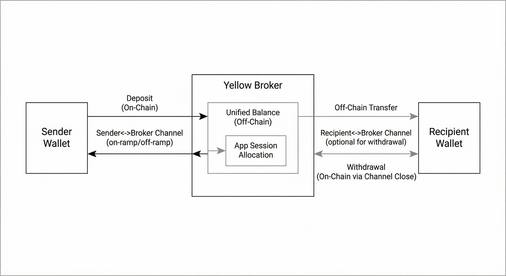

# x402 Extension: yellow

This document defines a hackathon extension that enables x402 v2 clients and servers to use Yellow Network's off-chain settlement (Nitro RPC) for bulk payments.

## Summary

The `yellow` extension lets an agent opt into Yellow off-chain settlement as an alternative to per-call facilitator transactions. The server advertises `extensions.yellow` in the `PaymentRequired` response, and the client echoes it in the `PaymentPayload` along with a transfer receipt from the clearnode.

This extension does not change core x402 v2 fields. It adds additional data under `extensions.yellow`.

## PaymentRequired

Servers include the extension in the `extensions` object. The `info` field describes the clearnode and pricing for the bulk settlement flow.

Example:

```json
{
  "x402Version": 2,
  "resource": {
    "url": "mcp://tool/stock_price",
    "description": "Paid tool: stock_price",
    "mimeType": "application/json"
  },
  "accepts": [
    {
      "scheme": "yellow-offchain",
      "network": "yellow:sandbox",
      "amount": "0.1",
      "asset": "usdc",
      "payTo": "0xMerchantAddress",
      "maxTimeoutSeconds": 60,
      "extra": {
        "settlement": "yellow"
      }
    }
  ],
  "extensions": {
    "yellow": {
      "info": {
        "clearnodeUrl": "wss://clearnet-sandbox.yellow.com/ws",
        "protocolVersion": "NitroRPC/0.4",
        "asset": "usdc",
        "pricePerCall": "0.1"
      },
      "schema": {
        "$schema": "https://json-schema.org/draft/2020-12/schema",
        "type": "object",
        "properties": {
          "clearnodeUrl": { "type": "string" },
          "protocolVersion": { "type": "string" },
          "asset": { "type": "string" },
          "pricePerCall": { "type": "string" },
          "transferId": { "type": ["number", "string"] },
          "payer": { "type": "string" }
        },
        "required": ["clearnodeUrl", "protocolVersion", "asset", "pricePerCall"],
        "additionalProperties": true
      }
    }
  }
}
```

## PaymentPayload (per-call fallback)

Clients include a transfer receipt in the `payload` field and mirror the `yellow` extension. This is the per-call fallback path.

Example:

```json
{
  "x402Version": 2,
  "accepted": {
    "scheme": "yellow-offchain",
    "network": "yellow:sandbox",
    "amount": "0.1",
    "asset": "usdc",
    "payTo": "0xMerchantAddress",
    "maxTimeoutSeconds": 60,
    "extra": { "settlement": "yellow" }
  },
  "payload": {
    "transferId": "12345",
    "payer": "0xBuyerAddress",
    "amount": "0.1",
    "asset": "usdc",
    "to": "0xMerchantAddress"
  },
  "extensions": {
    "yellow": {
      "info": {
        "clearnodeUrl": "wss://clearnet-sandbox.yellow.com/ws",
        "protocolVersion": "NitroRPC/0.4",
        "asset": "usdc",
        "pricePerCall": "0.1",
        "transferId": "12345",
        "payer": "0xBuyerAddress"
      },
      "schema": { "$schema": "https://json-schema.org/draft/2020-12/schema" }
    }
  }
}
```

## Notes

- This extension is intended for demos and experimentation.
- Servers should verify per-call transfers using `get_ledger_transactions` on the clearnode.
- For prepaid app sessions, clients pass `_meta["x402/yellow"]` with:
  - `appSessionId` (required)
  - `payer` (optional, used for close/refund)
- Servers query `get_ledger_balances` for the session account and debit per call. If the balance is insufficient, they return 402 and may attempt `close_app_session` to refund remaining allocation.
- Run `npm run demo` or `npm run e2e:paid-tools` from the repository root so the scripts can spawn `npm run dev` for the MCP server.
- The e2e script can request sandbox funds automatically when `YELLOW_AUTO_FAUCET` is not `false` (use `YELLOW_FAUCET_URL` to override).
- Use the hosted sandbox clearnode for testing: `wss://clearnet-sandbox.yellow.com/ws`.

## Production deposit flow (overview)

In production, funds must be deposited on-chain into Yellow’s custody contract before they can be used for off-chain transfers.

1. Deposit supported tokens (e.g., USDC) into the **custody contract** for your chain.
2. Open or reuse a channel for that chain + asset.
3. Fund the channel using `resize_amount` (custody-funded).
4. Perform off-chain transfers and include the receipt in `_meta["x402/payment"]`.

If you are using the sandbox faucet instead, fund the Unified Balance and use `allocate_amount` when resizing.

## Channel & app session flow (broker model)

Channels are always **wallet ↔ broker** (not wallet ↔ wallet). Think of a channel as the on‑ramp/off‑ramp for a wallet.



Sender flow:
1. Deposit on‑chain to custody.
2. Open channel (sender ↔ broker).
3. Resize (signed by sender, confirmed on‑chain).
4. Create app session (participants + quorum) and allocate funds.
5. Make off‑chain transfers (including to recipient).

Recipient flow:
1. Optionally open channel (recipient ↔ broker) if withdrawing on‑chain.
2. Resize to move off‑chain funds into the channel.
3. Close/withdraw to on‑chain wallet.

## Cursor MCP config

```json
"eXpress402-mcp": {
  "command": "npm",
  "args": ["run", "dev"],
  "env": {
    "YELLOW_MERCHANT_ADDRESS": "${env:YELLOW_MERCHANT_ADDRESS}",
    "YELLOW_MERCHANT_PRIVATE_KEY": "${env:YELLOW_MERCHANT_PRIVATE_KEY}",
    "YELLOW_CLEARNODE_URL": "${env:YELLOW_CLEARNODE_URL}",
    "YELLOW_ASSET_SYMBOL": "${env:YELLOW_ASSET_SYMBOL}",
    "YELLOW_PRICE_PER_CALL": "${env:YELLOW_PRICE_PER_CALL}",
    "YELLOW_NETWORK": "${env:YELLOW_NETWORK}",
    "YELLOW_MAX_TIMEOUT_SECONDS": "${env:YELLOW_MAX_TIMEOUT_SECONDS}",
    "YELLOW_AGENT_ADDRESS": "${env:YELLOW_AGENT_ADDRESS}",
    "TAVILY_API_KEY": "${env:TAVILY_API_KEY}",
    "REDDIT_USER_AGENT": "${env:REDDIT_USER_AGENT}",
    "YELLOW_DEBUG": "${env:YELLOW_DEBUG}"
  }
}
```

[](cursor://anysphere.cursor-deeplink/mcp/install?name=eXpress402-mcp&config=eyJjb21tYW5kIjoibnBtIiwiYXJncyI6WyJydW4iLCJkZXYiXSwiZW52Ijp7IllFTExPV19NRVJDSEFOVF9BRERSRVNTIjoiJHtlbnY6WUVMTE9XX01FUkNIQU5UX0FERFJFU1N9IiwiWUVMTE9XX01FUkNIQU5UX1BSSVZBVEVfS0VZIjoiJHtlbnY6WUVMTE9XX01FUkNIQU5UX1BSSVZBVEVfS0VZfSIsIllFTExPV19DTEVBUk5PREVfVVJMIjoiJHtlbnY6WUVMTE9XX0NMRUFSTk9ERV9VUkx9IiwiWUVMTE9XX0FTU0VUX1NZTUJPTCI6IiR7ZW52OllFTExPV19BU1NFVF9TWU1CT0x9IiwiWUVMTE9XX1BSSUNFX1BFUl9DQUxMIjoiJHtlbnY6WUVMTE9XX1BSSUNFX1BFUl9DQUxMfSIsIllFTExPV19ORVRXT1JLIjoiJHtlbnY6WUVMTE9XX05FVFdPUkt9IiwiWUVMTE9XX01BWF9USU1FT1VUX1NFQ09ORFMiOiIke2VudjpZRUxMT1dfTUFYX1RJTUVPVVRfU0VDT05EU30iLCJZRUxMT1dfQUdFTlRfQUREUkVTUyI6IiR7ZW52OllFTExPV19BR0VOVF9BRERSRVNTfSIsIlRBVklMWV9BUElfS0VZIjoiJHtlbnY6VEFWSUxZX0FQSV9LRVl9IiwiUkVERElUX1VTRVJfQUdFTlQiOiIke2VudjpSRURESVRfVVNFUl9BR0VOVH0iLCJZRUxMT1dfREVCVUciOiIke2VudjpZRUxMT1dfREVCVUd9In19)

## Claude MCP config (API)

Claude’s MCP support expects **URL-based** servers in the API request (`mcp_servers`), not stdio. To use this server with Claude, you’d need to host it behind an HTTP/SSE MCP endpoint.

```json
{
  "mcp_servers": [
    {
      "name": "eXpress402-mcp",
      "type": "url",
      "url": "https://your-hosted-mcp.example.com/mcp"
    }
  ]
}
```

No official “Add to Claude” button/deeplink is documented yet. Claude MCP servers are configured per API request. See Anthropic docs for `mcp_servers`: [https://platform.claude.com/docs/en/api/beta](https://platform.claude.com/docs/en/api/beta)
